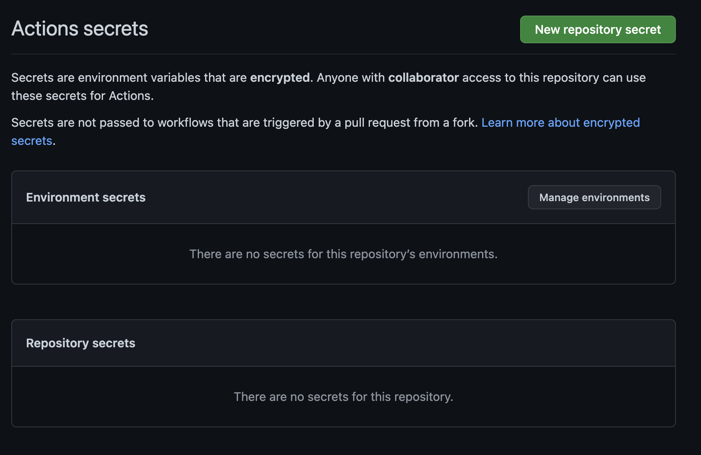

# 💯 Scenario #2: Secrets

## GitHub Workflow

Here's an excerpt from **Scenario #2z's workflow** which is responsible for creation of an RDS instance. It authenticates to the AWS account using the OIDC connector we discussed in the last scenario.&#x20;

```
...
        role-to-assume: 'arn:aws:iam::560957161703:role/AdminRole'
        aws-region: us-east-1

      - name: Create an RDS instance
        run: >
          aws rds create-db-instance --db-instance-identifier test-mysql
          --db-instance-class db.t3.micro --engine mysql --master-username admin
          --master-user-password mysecret --allocated-storage 20
...
```

### ❌ Committing Secrets

Committing secrets to workflows is a **huge security risk.** Passwords, tokens, and other forms of credentials which can be used to authenticate to a system should be stored in _dedicated secret managers_ rather than referencing them in plain-text.&#x20;

### ✅ Using GitHub Secrets

Luckily, GitHub providers support to store secrets easily and securely. Within the settings of your repository, head to **Secrets**, and open the **Actions** page.Here, new secrets can be created based on the desired usage. Once added, the secret gets encrypted and all references in jobs (which I'll show in a bit) don't show the value of the secret.

<figure><figcaption></figcaption></figure>

Now, to use the newly created secret in your workflow, you can reference it using: `{{RDS_MASTER_PASSWORD}}.`

The secret's value isn't output to the console upon execution of the command. It's secure and can now be updated or deleted but not viewed therefore keeping your secret... well, a "secret". You can definitely use external secret managers like HashiCorp's Vault if you've got the&#x20;

<figure><figcaption></figcaption></figure>

``
